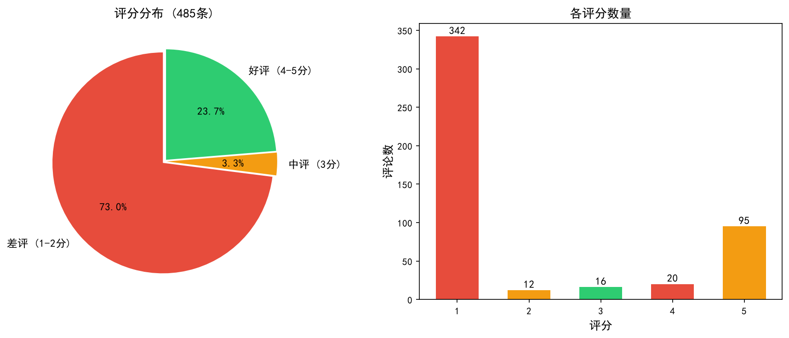
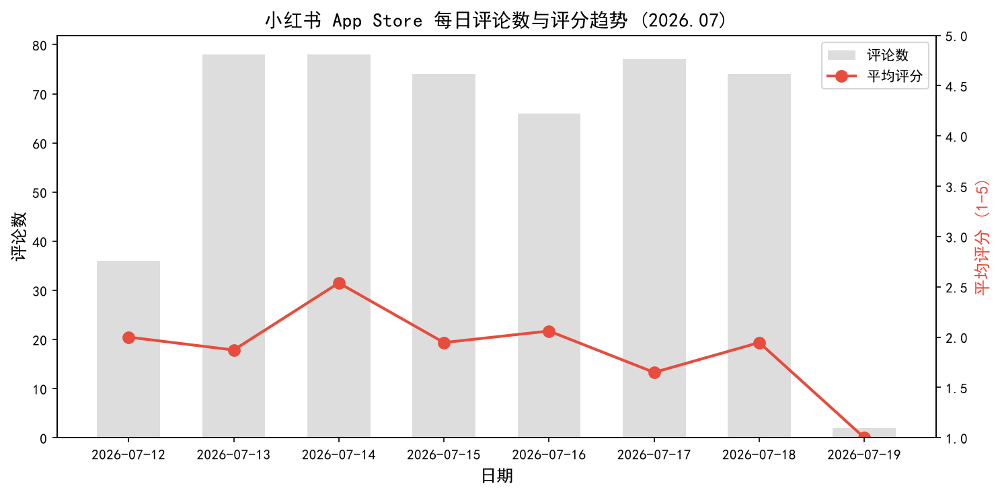
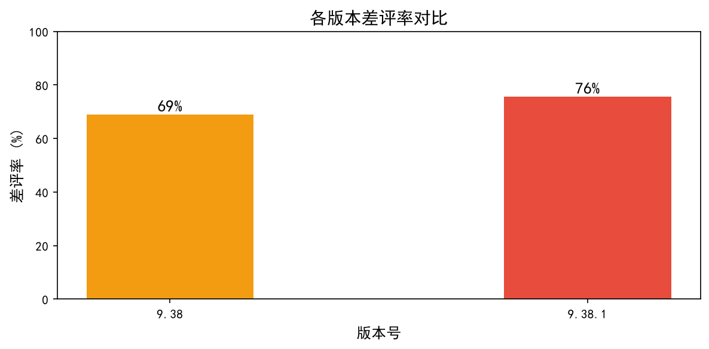
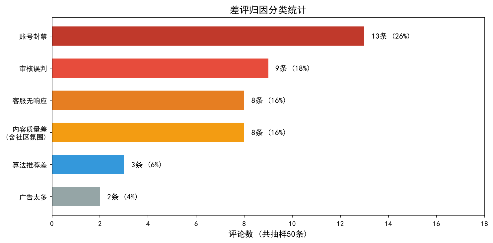

# 小红书用户留存分析与产品优化方案

**独立数据分析项目 | 2026 年 7 月**

> 工具：Python (Pandas / jieba / Matplotlib / WordCloud) | SQL | Git
> 角色：全流程独立完成 — 数据采集 → 清洗 → 分析 → 产品方案 → 报告

---

## 一、项目背景与分析目标

小红书（App ID: 741292507）是中国头部内容社区平台，MAU 超过 3 亿。通过对 App Store 近期用户评论的数据分析，定位影响用户满意度的核心问题，输出可落地的产品优化方案。

**初始假设**：差评主因是广告侵蚀内容体验、推荐算法同质化。

**实际结果**：数据修正了初始假设 — 60% 差评集中在账号风控与审核治理体系。

---

## 二、数据来源与处理方法

| 维度 | 说明 |
|------|------|
| 数据来源 | App Store 中国区 RSS Customer Reviews API |
| 采集范围 | 2026 年 7 月 12 日 — 7 月 19 日，共 500 条原始评论 |
| 清洗逻辑 | 去重（author+content）、移除短文本（<2 字）、日期格式化、版本号清洗 |
| 有效样本 | 485 条（差评 354 | 中评 16 | 好评 115） |
| 分析方法 | jieba 中文分词 + 词频统计 + 50 条抽样人工归因标注 + 评分趋势时序分析 |

### 2.1 数据概览

- **差评率 73.0%**（354 / 485），评分集中在 1-2 分区间
- App Store 评论区天然偏极端（不满用户更倾向留言），1 分评论占绝对主导
- 日期范围仅 8 天但评论密度达日均 60 条，说明差评是持续流而非偶发波动

---

## 三、分析发现

### 3.1 评分趋势：连续低位运行

- 日均评分 1.6-2.5，差评率 59%-82%，无一天超过 3.0
- 没有明显的"某天突然崩盘"，说明是**系统性、结构性**的问题，非单次事故
- 7 月 19 日仅 2 条样本，数据量不足，不纳入趋势判断

### 3.2 版本迭代与评分关联

| 版本 | 评论数 | 平均分 | 差评率 |
|------|--------|--------|--------|
| 9.38 | 184 | 2.1 | 69% |
| 9.38.1 | 300 | 1.9 | 76% |

- 新版本 9.38.1 差评率不降反升 +7 个百分点，本次迭代未有效解决用户核心痛点
- 两个版本差距不剧烈，说明问题根源不在某个版本的 feature change，而在更底层的**机制和流程**

### 3.3 差评归因：词频分析 + 人工标注双重验证

**方法**：先对 354 条差评全量跑 jieba 分词统计，再抽取 50 条样本做人工逐条归类，两路交叉验证。

#### 3.3.1 词频分析结果

差评 TOP 10 高频词：账号(88)、违规(84)、封号(77)、评论(53)、客服(52)、申诉(50)、垃圾(50)、审核(38)、封禁(35)、莫名其妙(33)

高频词自然聚类为三条叙事线：
- **账号与封禁**：账号 + 违规 + 封号 + 封禁 + 禁言 → 高频且密集
- **客服与申诉**：客服 + 申诉 → 排序靠前且相邻
- **审核不透明**：莫名其妙 + 审核 → 说明用户不理解处罚原因

#### 3.3.2 人工标注结果

| 归因类别 | 条数 | 占比 |
|---------|------|------|
| 账号封禁 | 13 | 26% |
| 审核误判 | 9 | 18% |
| 客服无响应 | 8 | 16% |
| 内容质量差（含社区氛围） | 8 | 16% |
| 算法推荐差 | 3 | 6% |
| 广告太多 | 2 | 4% |
| 其他 | 7 | 14% |

#### 3.3.3 核心结论

> **广告和内容同质化不是主要矛盾。60% 的差评集中在账号风控与审核治理体系：违规定义模糊、处罚理由不透明、申诉形同虚设、客服只会模板回复。这不是某一个环节坏了，是整条链路系统性失效。**

---

## 四、产品优化方案

### 优先级排序逻辑

三个方案覆盖了差评用户的三个关键情绪节点：
1. **被处罚时**：为什么封我？（→ 方案一：违规透明化）
2. **申诉时**：谁能帮我？（→ 方案二：申诉体系重构）
3. **求助时**：你在听我说话吗？（→ 方案三：客服去模板化）

方案一和方案二是同一根链条的前后两环，P0 并行推进。方案三独立，P1 跟进。

### 4.1 方案一：违规治理透明化（P0）

**覆盖**：27% 差评用户 | **投入**：中 | **预期**：申诉量降低 30%

1. 违规通知弹窗内**高亮标记触发原文**，直接展示是哪段内容触发风控
2. 每条处罚**绑定对应社区规范条款**，点击可跳转完整规则原文
3. **区分处罚等级展示影响**：禁言/限流/封禁分别标注时效与功能限制范围，同步展示历史记录
4. 新增**「自查整改指引」模块**，给出可落地的修改建议
5. 处罚通知底部常驻**「我有异议，发起申诉」快捷按钮**

### 4.2 方案二：申诉体系重构（P0）

**覆盖**：44% 差评用户 | **投入**：高 | **预期**：申诉满意度从接近 0 提升至 60%

**入口覆盖**：违规通知页 → 账号处罚记录 → 客服对话关键词触发，三个触点全覆盖

**流程**：提交材料 → AI 初审校验 → 中高风险转人工 → 24h 内通知 → 失败可升级二次复核

**兜底机制**：
- 申诉驳回后开放升级人工复核通道，允许补充凭证二次提交
- 失败详情页写入完整驳回依据（风控日志、判定原文）
- 高活跃/实名老用户永久封禁提供专属人工专线

**进度透明**：独立申诉进度页，实时展示「待初审/人工处理/已办结」+ 处理时效倒计时

### 4.3 方案三：客服沟通去模板化（P1）

**覆盖**：16% 差评用户 | **投入**：中 | **预期**：阻断差评情绪扩散

**产品侧**：开放风控查询权限给一线客服 → 对话自动同步账号处罚数据 → 情绪识别分流 → 工单关联闭环

**话术侧（三类核心场景）**：
- 误判封禁咨询：先共情 → 定位违规原文 → 直接帮开复核工单
- 申诉失败二次投诉：解释驳回原因 → 告知补充材料路径 → 升级复审
- 连带设备风控：解释风控逻辑 → 提供解除路径 → 承诺不牵连正常账号

---

## 五、个人反思

### 5.1 这个项目教会我什么

这次项目让我彻底摆脱了「凭感觉做产品分析」的思维，学会完全用数据和用户原声双证据推导结论。我最初主观认为小红书差评主要来自广告和内容问题，但通过量化统计和人工标注，真实数据推翻了我的初始假设，让我理解了产品问题优先排序必须以用户负面反馈权重为准。

同时我完整跑通了「采集 — 清洗 — 分析 — 归因 — 方案落地」的数据产品闭环，明白了数据分析不是画图，而是为产品决策提供可落地的优先级依据。从用户情绪链路拆解产品问题，把零散差评归纳成完整的风控申诉全链路问题，产出结构化优化方案——这个能力可以直接迁移到任何数据产品岗位。

### 5.2 遇到的最大困难及解决方式

项目最大难点是纯文本差评杂乱、用户口语化表达多，无法直接归类。一开始单纯用 jieba 词频只能看到高频词，无法判断真实问题占比。

解决方式：采用「机器词频粗筛 + 50 条样本人工逐条归因标注」的双重验证方法。先通过分词找到高频痛点方向，再人工逐条建立统一分类标准，修正机器统计偏差。最终得出 60% 风控类差评的真实占比，保证分析结论经得起推敲。

### 5.3 如果重新做一次，我会怎么改进

1. **引入情绪自动分类模型**：目前依靠人工标注，后续可以用简单情感分类模型（如 SnowNLP 或 BERT 微调）实现正负向情绪自动归类，使分析方法可适配更大数据量级。
2. **增加版本迭代对比维度**：将每个小版本的差评痛点分布做横向对比，精准定位具体版本上线的风控策略变更导致差评波动的因果链条，结论会更精细化。
3. **关联用户留存数据**：如果能获取到卸载率、次日留存等行为数据，可以把差评痛点与用户真实流失行为做关联验证，让产品方案的业务价值预估更准确。

### 5.4 这个项目与「数据产品经理」岗位的关联

本项目完整覆盖了数据产品经理的核心工作流：
- **数据采集与处理** — 从公开 API 获取数据，清洗、结构化
- **指标定义与归因分析** — 定差评率、归因分类体系，交叉验证结论
- **产品方案设计** — 从数据洞察到可执行的产品改动，附指标预估
- **跨职能思维** — 不只看数据，也做用户原声分析、竞品对标、话术设计

---

## 附录

- A. 数据样本（clean_reviews.csv, 485 条）
- B. 分析代码（fetch_reviews.py / clean_reviews.py / analyze_reviews.py / visualize.py）
- C. 可视化图表（charts/ 目录，共 5 张）
- D. 差评抽样标注（sample_bad_reviews.csv, 50 条）
- E. 工具链：Python 3.11 / Pandas / jieba / Matplotlib / WordCloud / Git

---

*项目仓库：[GitHub 链接] | 完成日期：2026 年 7 月 | 独立完成*
